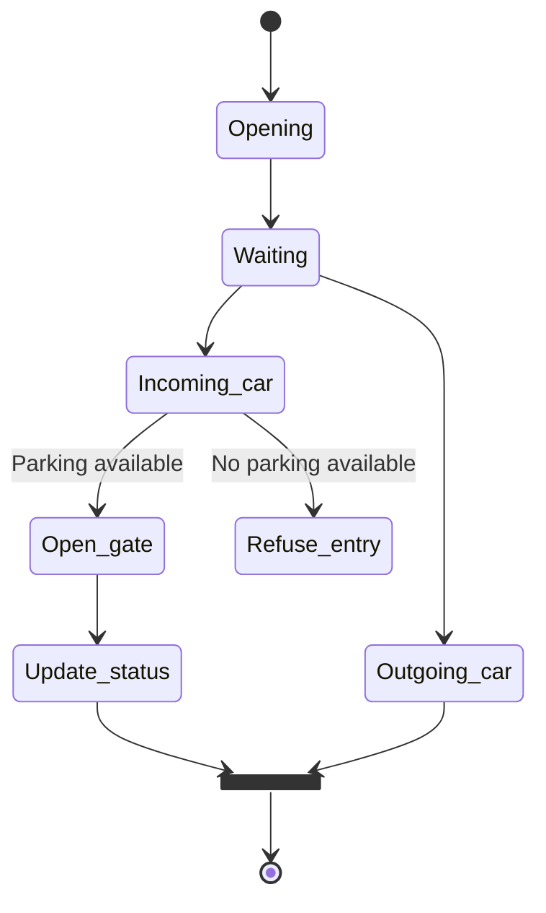

# Tiny Parking System

This repository contains all of the code (and more) about our project for the Embedded System and Internet of Things course, held by prof. Kasim Sinan Yildirim.

Our project, Tiny Parking System, wants to simulate a realistic parking system scaled to small sized vehicles (like toy cars or very small RC vehicles) by creating an automated environment for parking management, which can be managed and controlled autonomously (and remotely, too) thanks to the complex interconnected environment made up by the various sensors, modules and web services.


### Table of Contents

- [About the project](#about-the-project)
- [Work organization](#work-organization)
- [How it works](#how-it-works)
- [Project documentation](#work-organization)
  - [Libraries documentation](#libraries-documentation)
  - [Error codes meaning](#error-codes-meaning)
  - [Serial communication](#serial-communication)
  - [Debugging](#debugging)
  - [Web Server](#web-server)
- [Requirements](#requirements)
  - [Hardware Requirements](#hardware-requirements)
  - [Software requirements](#software-requirements)
- [Known issues and possible improvements](#known-issues-and-possible-improvements)
- [Conclusions](#conclusions)
- [Additional resources](#additional-resources)


## About the project

The project has been developed by the following students:
| Name | Contact |
| -- | -- |
| Mirco Stelzer | mirco.stelzer@studenti.unitn.it |
| Leonardo Conforti | leonardo.conforti@studenti.unitn.it |
| Daniel Casagranda | daniel.casagranda@studenti.unitn.it |
| Amar Sidkir | amar.sidkir@studenti.unitn.it |

Our work is based on everything we have learned in the last 3 years, but most importantly most of the guidelines were took from the teacher lectures. Some examples include:
- Code structure
- Testing and debugging
- Interoperability
- Hardware dependent/independent functions
- And more...


## Work organization


## How it works



### General features

- A dispositivo LED RGB (green/red/blue) will indicate in real-time the availability of parking spaces: the LED will be green when free spots are available, red when the parking lot is full, and blue if the object entering is not a car.
- If the parking lot is full, the system will prevent the opening of the entrance barrier, thereby blocking vehicle access.
- An LCD display will continuously show the parking lot’s opening and closing hours, beyond which access will be allowed only for exits.
- A digital display will show the updated number of available free spots.

### Vehicle Entry and Exit Management

- Sensors will be installed at both the entrance and exit points to detect vehicles passing through.
- Upon detection of a vehicle entering or exiting, the barrier will automatically lift to allow passage.
- Simultaneously, the counter of free parking spots will be incremented or decremented according to the flow of vehicles.
- Updated information regarding occupied and free spots will be continuously reported on an online control dashboard.
- (Maybe?) Find if its possible to have a sort of “bluetooth/radio” key which, if pressed, opens the gate. This can also activate the barrier if in a close range, which indicates the owner of the key inside the vehicle is nearby

### Sensors and Object Type Discrimination

- To discriminate between vehicles (cars, trucks) and other presences (e.g., pedestrians) at the entrance, a weight sensor will be used (ha lo stesso costo del sensore ultrasuoni di circa 2 su AliExpress).
- The entrance barrier will lift only in the presence of a vehicle identified as a car, preventing unintended openings for trucks or pedestrians.
- An ultrasonic sensor will be used to detect cars exiting and will safely raise the corresponding barrier.
- Naturally, all vehicles inside the lot can exit freely.

### Access Constraints for Heavy Vehicles

- The system will prevent trucks from entering if they were not authorized to enter through the entrance barrier, thus ensuring consistent and secure access control.
- If vehicles other than cars are authorized to enter, this implies they have a dedicated remote control for access that allows them to raise the entrance barrier.

### Computer Vision

- A camera sensor captures the front of the car, and thanks to a computer vision model, extracts the license plate to keep track of who enters the parking lot. This is a new information to store in our dataset.
    - Possible variation: We have a dataset of the cars (license plates) allowed to access the parking. When a car try to enter, if its license plate is not in the database, the barrier will not lift.

### Online Dashboard

- Simulation of time (possibly to communicate the opening/closing of the parking lot) by a dedicated wheel/input from the dashboard
- A view of free and occupied parking lots:
    - This requires to know which lot is the car parking onto, maybe via small detection sensors installed under each parking lot


## Project documentation


## Requirements


### Configuration
- First, download the ESP-IDF framework. A complete guide can be found [here](https://docs.espressif.com/projects/esp-idf/en/v5.5.2/esp32s3/get-started/index.html).
- Run the following commands:
  ```bash
    idf.py set-target esp32s3
    idf.py fullclean
    idf.py menuconfig 
  ```
  Once landed in the configuration menu, enable the following options:
  - Enable PSRAM (through Component config) and set     Octal Mode, 80 MHz frequency

## Known issues and possible improvements


## Conclusions


## Additional resources
