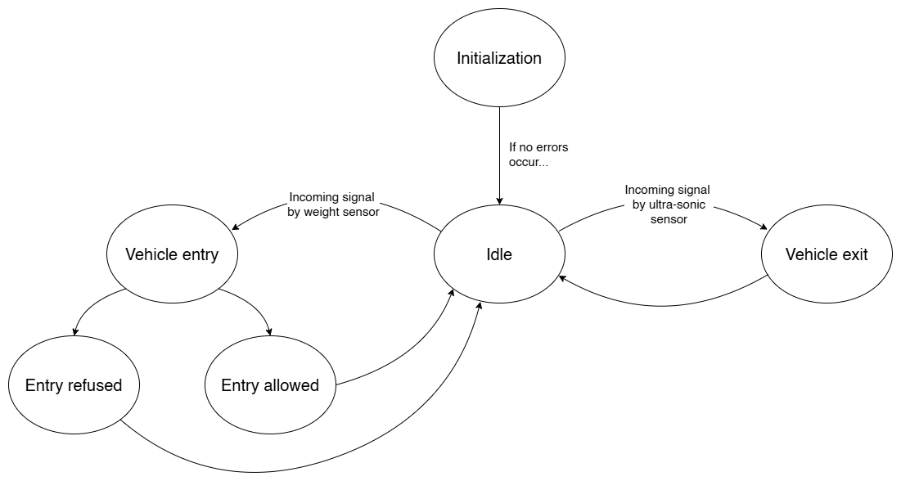
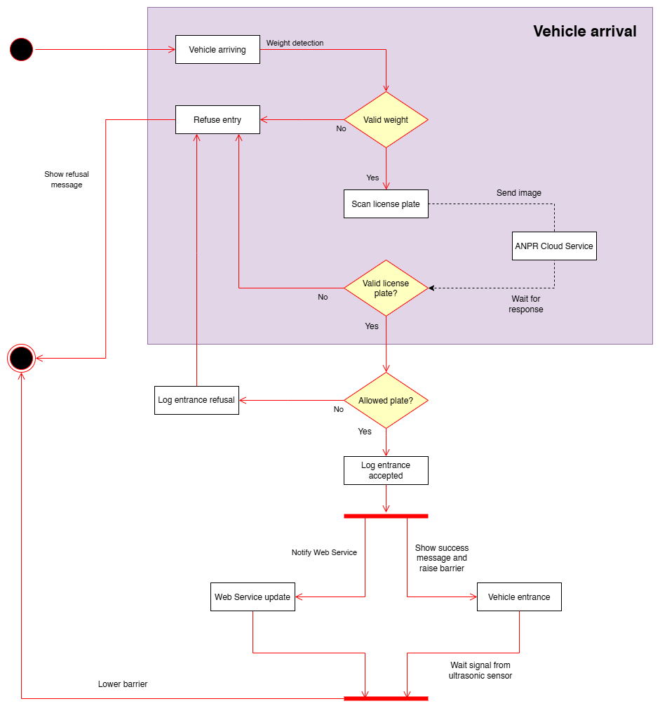

# Tiny Parking System - Embedded Software for the Internet of Things

This repository contains all of the code (and more) about our project for the Embedded Software for the Internet of Things course, held by prof. Kasim Sinan Yildirim.

Our project, Tiny Parking System, wants to simulate a realistic parking system scaled to small sized vehicles (like toy cars or very small RC vehicles) by creating an automated environment for parking management, which can be managed and controlled autonomously thanks to the complex interconnected environment made up by the various sensors, modules and web services.

### Website links
https://tinyparkingsystem.vercel.app/

https://tinyparkingsystem-api.vercel.app/ (API)

### Table of Contents
- [Website links](#website-links)
- [About the project](#about-the-project)
- [How it works](#how-it-works)
  - [State diagram](#state-diagram)
  - [User cases flow diagram](#user-cases-flow-diagram)
  - [General features](#general-features)
  - [Vehicle Entry and Exit Management](#vehicle-entry-and-exit-management)
  - [Sensors and Object Type Discrimination](#sensors-and-object-type-discrimination)
  - [Access Constraints for Heavy Vehicles](#access-constraints-for-heavy-vehicles)
  - [Computer Vision](#computer-vision)
  - [Online Dashboard](#online-dashboard)
- [Project documentation](#project-documentation)
  - [Project structure](#project-structure)
  - [Project Architecture](#project-architecture)
    - [Dependencies](#dependencies)
  - [API Endpoints](#api-endpoints)
    - [System Status](#system-status)
    - [Allowed Plates](#allowed-plates)
    - [Vehicle Entry](#vehicle-entry)
    - [Vehicle Exit](#vehicle-exit)
  - [Data Structure](#data-structure)
    - [System Status Object](#system-status-object)
- [Configuration](#configuration)
  - [Prerequisites](#prerequisites)
  - [1. Clone the repository](#1-clone-the-repository)
  - [2. Setting up the circuit](#2-setting-up-the-circuit)
    - [Hardware Components](#hardware-components)
    - [Pinout](#pinout)
    - [Weight Calibration](#weight-calibration)
  - [3. Configure the ESP-IDF framework](#3-configure-the-esp-idf-framework)
  - [4. Setting up the Web Service](#4-setting-up-the-web-service)
- [Run the project](#run-the-project)
- [Web Service and Dashboard](#web-service-and-dashboard)
- [Wokwi Simulation](#wokwi-simulation)
- [Known issues and possible improvements](#known-issues-and-possible-improvements)
- [Testing](#testing)
  - [Testing the FSM](#testing-the-fsm)
  - [Testing the sensors](#testing-the-sensors)
- [Conclusions](#conclusions)
  - [Validation of a Complete IoT Ecosystem](#validation-of-a-complete-iot-ecosystem)
  - [Effectiveness of Modular Software Architecture](#effectiveness-of-modular-software-architecture)
  - [Power Management and Optimization](#power-management-and-optimization)
  - [Sensor Fusion and Security](#sensor-fusion-and-security)
  - [Scalability and Awareness of Limitations](#scalability-and-awareness-of-limitations)
  - [Educational Value](#educational-value)
  - [Ending](#ending)
- [Additional resources](#additional-resources)
  - [Presentation](#presentation)
  - [Video](#video)

## About the project

The project has been developed by the following students:
| Name | Contact | Work made |
| -- | -- | -- |
| Mirco Stelzer (Group Leader) | mirco.stelzer@studenti.unitn.it | FSM development, weight sensor module, system initialization, OLED module|
| Leonardo Conforti | leonardo.conforti@studenti.unitn.it | Wokwi Configuration, Computer vision module, Servo module, final draft of the readme |
| Daniel Casagranda | daniel.casagranda@studenti.unitn.it | circuit engineering, single sensor testing, code development, 3d model | 
| Amar Sidkir | amar.sidkir@studenti.unitn.it | HTTPs modules (esp), ultrasonic sensor module, state response handling module, front-end and back-end web-service |

*Every member also contributed actively to the project's strategic decision-making and hands-on validation during team sessions. Many features have been developed either in a 
pair-programming fashion, or during team meetings.

Our work is based on the knowledge we've gained in the last 3 years, with most of the guidelines learned during teacher's lectures. Some examples include:
- Code structure
- Testing and debugging
- Interoperability
- Hardware dependent/independent functions
- Optimization and scalability

## How it works

### State diagram



A finite state machine handles the behaviour of the whole system as a separate, non-blocking task. The FSM manages state transitions based on sensor events (such as vehicle detection, license plate recognition, and exit signals), controls the barrier, and display updates accordingly. The system optimizes power consumption by entering a low-power sleep mode when  idle, otherwise notifies and creates the appropriate task based on the logic displayed above.

### Use cases flow diagram


The User Flow Diagram above illustrates the logical sequence executed by the system from the moment a vehicle approaches the entrance. The process is divided into three main stages: detection, authentication, and execution.

1.  **Vehicle Detection & Classification:**
    * The process begins with **Vehicle Arrival**. The system first performs a **Weight Detection** check.
    * **Decision:** If the weight is valid (recognized as a car), the system proceeds to the next stage, otherwise it remains idle.

2.  **Authentication (ANPR):**
    * The camera activates to **Scan the license plate**. The image is sent to the **ANPR Cloud Service** for processing.
    * **Validation:** The system waits for the cloud response to verify if the license plate is legible and valid.
    * **Authorization:** If valid, it checks the internal database to see if the plate is on the **Allowed List**.
    * If at any point the plate is invalid or unauthorized, the system logs the refusal and denies entry.

3.  **Access Execution:**
    * Upon successful authorization, the system logs the **Entrance Accepted** event.
    * The flow then splits into **parallel tasks**:
        * **Digital:** The system notifies the **Web Service** to update the dashboard and logs.
        * **Physical:** The OLED displays a success message, and the servo motor **raises the barrier**.
    * Finally, the system waits for the **Ultrasonic Sensor** to signal that the vehicle has physically entered. Once the passage is confirmed, the barrier is lowered, and the system returns to its initial state.

### General features

- If the parking lot is full, the system will prevent the opening of the entrance barrier, thereby blocking vehicle access.
- An OLED display continiously shows information about the number of available parking lots, and the state in the process during entrance and exit.
### Vehicle Entry and Exit Management
- Sensors will be installed at both the entrance (a weight sensor) and exit (a ultrasonic sensor) points to detect vehicles passing through.
- Simultaneously, the counter of free parking spots will be incremented or decremented according to the flow of vehicles.
- Updated information regarding occupied and free spots will be continuously reported on the webservice dashboard.
### Sensors and Object Type Discrimination

- To discriminate between vehicles (cars, trucks) and other presences (e.g., pedestrians) at the entrance, a weight sensor will be used.
- The entrance barrier will lift only in the presence of a vehicle identified as a car, preventing unintended openings for trucks or pedestrians (this feature is given by the use of a threshold positioned at a logical level on the weight sensor).
- An ultrasonic sensor will be used to detect cars exiting and will safely raise the barrier (Naturally, all vehicles inside the lot can exit freely).

### Access Constraints for Heavy Vehicles

- The system will prevent trucks from entering if they were not authorized to enter through the entrance barrier, thus ensuring consistent and secure access control.

### Computer Vision

- A camera sensor captures the front of the car, and thanks to a computer vision model, extracts the license plate to keep track of who enters the parking lot.
- We have a dataset of the cars (license plates) allowed to access the parking. When a car tries to enter, if its license plate is not in the database, the barrier will not lift.

### Online Dashboard

- Comprehensive visualization of all project-specific information, metadata, and key operational metrics within a unified interface.

- Real-time monitoring of the system status featuring dynamic visualization of active modules (sensors), live processing results, and immediate reporting of any specific errors of the sensors.

- Complete system log archive providing a fully searchable and chronological history of all recorded events, warnings, and system activities.

- Interactive 3D representation of the parking infrastructure integrated with a detailed real-time registry of available and recognized license plates.


## Project documentation

### Project structure:

```
Tiny-Parking-System/
├── .gitignore
├── 3d-print-model/
│   ├── images/
│   │   ├── 1.png
│   │   ├── 2.png
│   │   ├── 3.png
│   │   └── 4.png
│   └── models/
│       ├── Esp32.ipt
│       ├── breadboard.ipt
│       ├── build.iam
│       ├── frontal_floor.ipt
│       ├── lateral_floor.ipt
│       ├── lcd.ipt
│       ├── load_floor.ipt
│       ├── loadcell.ipt
│       ├── loadcell_card.ipt
│       ├── loadcell_spacer.ipt
│       ├── servo.ipt
│       ├── spacer.ipt
│       ├── ultrasound.ipt
│       ├── under_floor.ipt
│       └── upsert_floor.ipt
├── LICENSE
├── README.md
├── esp/
│   ├── .clangd
│   ├── .devcontainer/
│   │   ├── Dockerfile
│   │   └── devcontainer.json
│   ├── .gitignore
│   ├── CMakeLists.txt
│   ├── components/
│   │   ├── cv/
│   │   │   ├── CMakeLists.txt
│   │   │   ├── cv.c
│   │   │   ├── cv.h
│   │   │   └── mock_plate.jpg
│   │   ├── https/
│   │   │   ├── CMakeLists.txt
│   │   │   ├── https.c
│   │   │   ├── https.h
│   │   │   ├── https_task.c
│   │   │   └── https_task.h
│   │   ├── init/
│   │   │   ├── CMakeLists.txt
│   │   │   ├── init.c
│   │   │   └── init.h
│   │   ├── oled/
│   │   │   ├── CMakeLists.txt
│   │   │   ├── idf_component.yml
│   │   │   ├── oled.c
│   │   │   └── oled.h
│   │   ├── servo_motor/
│   │   │   ├── CMakeLists.txt
│   │   │   ├── idf_component.yml
│   │   │   ├── servo_motor.c
│   │   │   └── servo_motor.h
│   │   ├── ultrasonic_sensor/
│   │   │   ├── CMakeLists.txt
│   │   │   ├── ultrasonic_sensor.c
│   │   │   └── ultrasonic_sensor.h
│   │   ├── weight/
│   │   │   ├── CMakeLists.txt
│   │   │   ├── weight.c
│   │   │   └── weight.h
│   │   └── wifi/
│   │       ├── CMakeLists.txt
│   │       ├── wifi.c
│   │       └── wifi.h
│   ├── dependencies.lock
│   ├── diagram.json
│   ├── main/
│   │   ├── CMakeLists.txt
│   │   ├── Kconfig.projbuild
│   │   ├── fsm.c
│   │   ├── fsm.h
│   │   ├── idf_component.yml
│   │   └── main.c
│   └── wokwi.toml
├── images/
│   ├── FSM.png
│   ├── FSM_transparent.png
│   ├── FlowDiagram.png
│   ├── FlowDiagram_transparent.png
│   └── project-icon.png
├── package-lock.json
└── web-service/
    ├── api/
    │   ├── .gitignore
    │   ├── app.js
    │   ├── index.html
    │   ├── lib/
    │   │   ├── data.js
    │   │   └── utils.js
    │   ├── openapi.yaml
    │   ├── package-lock.json
    │   ├── package.json
    │   ├── routes/
    │   │   ├── allowed.js
    │   │   ├── entry.js
    │   │   ├── exit.js
    │   │   └── status.js
    │   ├── static/
    │   │   └── favicon.ico
    │   └── vercel.json
    └── frontend/
        ├── .gitignore
        ├── app/
        │   ├── favicon.ico
        │   ├── globals.css
        │   ├── layout.tsx
        │   └── page.tsx
        ├── components.json
        ├── components/
        │   ├── ParkingLot/
        │   │   ├── ManageAllowedPlates.tsx
        │   │   └── SplineComponent.tsx
        │   ├── ParkingLotSection.tsx
        │   ├── ProjectInfoSection.tsx
        │   ├── SystemLogSection.tsx
        │   ├── SystemStatus/
        │   │   └── ModuleStatusCard.tsx
        │   ├── SystemStatusSection.tsx
        │   └── ui/
        │       ├── badge.tsx
        │       ├── button-group.tsx
        │       ├── button.tsx
        │       ├── card.tsx
        │       ├── dialog.tsx
        │       ├── dropdown-menu.tsx
        │       ├── field.tsx
        │       ├── input.tsx
        │       ├── label.tsx
        │       ├── resizable.tsx
        │       ├── scroll-area.tsx
        │       ├── separator.tsx
        │       ├── switch.tsx
        │       └── tabs.tsx
        ├── eslint.config.mjs
        ├── hooks/
        │   └── useLocalStorage.ts
        ├── lib/
        │   └── utils.ts
        ├── next.config.ts
        ├── package-lock.json
        ├── package.json
        ├── postcss.config.mjs
        └── tsconfig.json
```
### Project Architecture

The project follows a service-oriented architecture using the ESP-IDF component manager to integrate external driver libraries listed in [`idf_component.yml`](esp/main/idf_component.yml). The build system leverages CMake to incorporate custom [`components`](esp/components/), ensuring scalability and modularity for future development.

#### Dependencies

The project utilizes the following third-party libraries:

| Library | Purpose |
| -- | -- |
| `espressif/esp32-camera` | Camera interface for computer vision |
| `esp-idf-lib/ultrasonic` | Ultrasonic sensor for vehicle detection |
| `esp-idf-lib/hx711` | Weight sensor for vehicle classification |
| `espressif/cjson` | JSON parsing for API communication |
| `espressif/servo` | Servo motor for the parking barrier |
| `nopnop2002/ssd1306` | OLED for information display | 

### API Endpoints

#### System Status
- **GET /status** → Returns current system status including board status, logs, allowed plates, and parking spots
- **PUT /status** → Updates or initializes the system status with new board state

#### Allowed Plates
- **PUT /allowed** → Updates the list of allowed license plates, which can enter the parking lots 

#### Vehicle Entry
- **POST /entry** → Records a vehicle entry attempt
  - Request: `{ licensePlate, recordedWeight, imageUrl? }`
  - Response: `{ allowed: boolean, message: string }`
  - Validates license plate format (alphanumeric, max 7 characters)
  - Checks if license plate is in the allowed list
  - Parks vehicle if spot is available

#### Vehicle Exit
- **POST /exit** → Records a vehicle exiting the parking system
  - Request: `{ licensePlate }`
  - Response: `{ message: string }`
  - Removes vehicle from parking spot

### Data Structure

#### System Status Object
```json
{
  "boardStatus": [
    {
      "name": "string",
      "status": "No connection|Active|Failed",
      "espStatus": "string"
    }
  ],
  "logs": [
    {
      "type": "info|success|warning|error",
      "message": "string",
      "imageUrl": "string (optional)",
      "timestamp": "ISO 8601"
    }
  ],
  "allowedPlates": ["string"],
  "spots": [
    {
      "id": "integer",
      "isOccupied": "boolean",
      "occupiedBy": "string",
      "occupiedAt": "ISO 8601 or null"
    }
  ],
  "openingTime": "HH:mm",
  "closingTime": "HH:mm",
  "initializedAt": "ISO 8601 or null",
  "lastUpdateAt": "ISO 8601 or null"
}
```

## Configuration

### Prerequisites
Before getting started, ensure that you have the following installed:
- **Node.js** (version 12 or later)
- **npm** (comes with Node.js)

### 1. Clone the repository

  ``` 
  git clone https://github.com/AmarS03/Tiny-Parking-System.git
  ```

### 2. Setting up the circuit
#### Hardware Components
The sensors and modules used for this project are:
- 1x ESP32-S3
- 1x Ultrasonic sensor (HC-SR04)
- 1x weight sensors (HX711)
- 1x servo motor (SG90)
- 1x OLED display (SSD1306)
- 1x OV3660 camera

#### Pinout
| Component | GPIO Pin |
| -- | -- |
| Camera PWDN | GPIO 38 | yellow
| Camera VSYNC | GPIO 6 | green   
| Camera HREF | GPIO 7 | blue
| Camera PCLK | GPIO 13 | black
| Camera XCLK | GPIO 15 | red 
| Camera SDA | GPIO 4 | orange 
| Camera SCL | GPIO 5 | white 
| Camera D0-D7 | GPIO 11, 9, 8, 10, 12, 18, 17, 16 |
| Ultrasonic TRIG | GPIO 3 |
| Ultrasonic ECHO | GPIO 20 |
| Weight Sensor DOUT | GPIO 21 |
| Weight Sensor CLK | GPIO 14 |
| Servo Motor PWM | GPIO 46 |
| OLED SDA | GPIO 42 |
| OLED SCL | GPIO 41 |

...


#### Weight Calibration
 - The project provides a code stub for the weight sensor calibration. It requires the user to place an object of known weight on the platform when prompted and wait for the process to finish.
 - The offset is stored in an NVS partition and it's loaded each time the application is run.
 - In order to run the calibration code, go to Project Configuration in [menuconfig]() and enable the Weight Calibration flag.

### 3. Configure the ESP-IDF framework
- Download the ESP-IDF framework A complete guide can be found [here](https://docs.espressif.com/projects/esp-idf/en/v5.5.2/esp32s3/get-started/index.html).
- Run the following commands:
  ```bash
    idf.py set-target esp32s3
    idf.py fullclean
    idf.py menuconfig 
  ```
- Once landed in the configuration menu, enable the following options:
  - Enable ESP PSRAM (through Component config)
    - Enable Octal Flash and set clock speed to 80 MHz
  - Set the correct flash size (usually 8 MB) and make sure that the SPI speed matches the one of the PSRAM (through Serial flasher config)
  - Set the WiFi SSID and password in Project Configuration (these will be locally stored in the configuration file)
  - Set the Partition Table to large single factory app; this will allow you to flash the executable on the device

### 4. Setting up the Web Service
- Inside **/web-service/api/** run:
  - `npm install`
  - `node app.js`
- Inside **/web-service/frontend/** run:
  - `npm install`
  - `npm run build`
  - `npm run dev`

## 3D Printed Structure
The project features a custom-designed hardware component modeled using Autodesk Inventor and AutoCAD to ensure structural precision. Following the CAD design phase, the physical prototype was fabricated using 3D printing technology, allowing us to seamlessly transition from digital specifications to a functional real-world model.

## Run the project
Once everything is setup properly simply run the following command:
    ```bash
    idf.py build flash monitor 
    ```

## Web Service and Dashboard
We also developed a web service in order to have an online live dashboard which allows the user to navigate between 4 different main sections:
1. **Homepage** (Project info): this section provides a complete overview of the project from the initial idea to the documentation for starting the project and what it needs in term of harware, to the link of the video and all the other information about the project
2. **System status**: here you can see in real time the actual various module statuses, which are updated on each initialization and show the corresponding status and eventual error code if something goes wrong.
3. **System log**: here you can see all logged events happening in real time, from the system initialization to the event of vehicle entering/exiting, including the captured image (elaborated by the CV algorithm) with the corresponding plate number for entry requests.
4. **Parking simulation**: this section offers a realtime 3D model and a grid view of the current parking lot status (showing the vehicles plate in the current parked spots), which updates whenever a vehicle enters or exits the parking lot with dedicated animations too. In this section you also have the ability to add and remove any plate number which is allowed to enter in the parking lot.

## Wokwi Simulation
- The project also offers the possibility to test the whole system without having any additional hardware, thanks to the integration with [Wokwi](https://wokwi.com/). This allows the user to prototype and test fast and remotely.
- In order to run the simulation successfully:
  - Go back to the configuration menu
  - Make sure to disable PSRAM, otherwise Wokwi will abort the process
  - Go to Project Configuration and enable the mock camera option. This will automatically set the SSID and password to run the example in Wokwi, which uses a pre-fetched mock image to test the CV algorithm.
  - Go to https://www.circuitdigest.cloud, login or create an account and generate your API key. This will be used to query the cloud server for the NPR algorithm.
  - Come back to the Project Configuration menu and paste your API key.
- After everything's set, open the [diagram.json](esp/diagram.json) file and start the simulation. Play with the sensors to see the different interactions.

## Known issues and possible improvements

1. Two or more vehicles cannot enter and exit the parking lot simultaneously. This does not obviously reflect real life parking lots, where we have two separate lanes. The reason is simply the budget limitation to buy double the amount of equipment (barriers, motors, weight sensors, ultrasound sensors...), just to resolve this small issue. So we simply imposed that one vehicle can only enter or exit at a time.

2. Vehicle exiting from the parking lot should also be recognized with a secondary camera. Due to the budget limitation, we opted for a manual removal instead by simulating the process and randomly removing one of the parked vehicle.

## Testing
To ensure the reliability of the system, we adopted a bottom-up testing strategy: validating individual hardware components first, and then verifying the overall system logic.

### Testing the FSM
Before deploying the code onto the physical hardware, we utilized the Wokwi simulation environment to validate the system's control flow. This allowed us to:
- Verify that the Finite State Machine (FSM) transitions correctly between states without deadlocks.
- Simulate the interaction between the microcontroller and the Web Service in a controlled environment.
- Debug the logic without the risk of hardware failures or electrical noise.

### Testing the sensors

Thanks to our modular project structure, where each driver resides in its own dedicated component folder (e.g., cv, servo_motor, weight), we were able to simply use methods to perform testing on each sensors. in fact we created a module called "init" were we initialize and calibrate the sensor before running the fsm.

Key findings and calibrations performed during this phase included:
- Camera Module: During the image acquisition tests, we discovered that the physical mounting position of the camera resulted in vertically flipped images. We implemented a software correction (vertical flip configuration) during the driver initialization to ensure the ANPR cloud service receives correctly oriented images.
- Weight Sensor (HX711): We conducted extensive testing to determine the correct calibration factor using objects of known weight. We also empirically defined a specific weight threshold to reliably distinguish between a toy car and other objects (or signal noise), ensuring the system ignores pedestrians or lightweight debris.
- Servo Motor: We tested the PWM signal generation to map the logical angles to physical movement. Specifically, we calibrated the 0° (closed) and 90° (open) positions to ensure the physical barrier arm was attached at the correct angle relative to the motor's gear.
- Ultrasonic Sensor: We performed distance measurement tests to define the optimal detection range. We set a specific distance threshold to ensure the sensor triggers the "Vehicle Exit" state only when a car is actually passing through, filtering out background reflections.
- OLED Display: We iterated on the UI design, testing different font sizes to ensure that status messages were legible and fit perfectly within the 128x64 screen resolution.

## Conclusions
### Validation of a Complete IoT Ecosystem
The project successfully demonstrated the feasibility of an end-to-end automated parking system. We achieved full integration between the physical layer (sensors and actuators), the logic layer (embedded firmware on ESP32-S3), and the application layer (Web Dashboard) and testing layer (with wokwi). The system autonomously manages the entire parking lifecycle:
- Vehicle detection and classification (with weight sensor).
- Access authorization (with Computer Vision and license plate reading).
- Vehicol detection management (via ultrasonic sensors and internal logic).
- Real-time remote visualization (Dashboard and 3D representation).

### Effectiveness of Modular Software Architecture

Adopting a Service-Oriented Architecture (SOA) and using the ESP-IDF Component Manager proved to be a winning strategy. The modular code structure (divided into components like cv, weight, ultrasonic_sensor, servo_motor, wifi etc.) ensured:
- High maintainability and software scalability.
- Isolation of hardware-dependent functions from core logic.
- A clean implementation of a Finite State Machine (FSM) that manages transitions in a non-blocking manner, ensuring stability even during complex operations like image processing.

### Power Management and Optimization

The system goes beyond pure functionality by integrating energy efficiency logic typical of real-world embedded systems. By implementing Low-Power Sleep modes when the system is in idle, and activating high-computation tasks (such as Computer Vision) only upon specific events (vehicle detection), we demonstrated conscious and efficient management of the microcontroller's resources.
Our decision to push the CV task to the cloud, rather than processing everything on the edge device, proved to be efficient in terms of power consumption and computational demand.

### Sensor Interoperability and Security

A key strength of the project is the combined use of different sensor types to ensure secure and correct access control:
- Object Type Discrimination: The combination of the weight sensor and logical thresholds prevents the barrier from opening for pedestrians or unauthorized vehicles (e.g., heavy trucks), simulating realistic security scenarios.
- License Plate Recognition (ANPR): Integrating the camera with a Computer Vision model adds an advanced layer of biometric/identification security, allowing access based on a strict whitelist.

### Scalability and Awareness of Limitations
The project identifies limits imposed by budget and hardware (such as the single gate bottleneck for both entry/exit and the manual simulation of the exit process). However, the software infrastructure was designed to be hardware-agnostic: the use of REST APIs and standard protocols would allow, given a higher budget, easy scaling to a double gate system or industrial hardware without rewriting the core logic.

### Educational Value
The project synthesizes the skills acquired over the semester and more, demonstrating mastery in:
- Hardware/Software Debugging: Managing serial protocols, sensor calibration (weight), and configuring complex peripherals (PSRAM, Camera).
- Interoperability: Effective communication between the microcontroller and web/cloud services.
- Rapid Prototyping: Leveraging simulation tools like Wokwi for development parallel to the physical hardware setup.

### Ending
Tiny Parking System is not just a functional prototype, but a concrete example of how heterogeneous embedded technologies can be orchestrated to solve a real-world problem or automate repetitive tasks without the need for human supervision.
## Additional resources

#### Presentation:
[Link to PDF Presentation](https://drive.google.com/file/d/1yZuzv3B2_5S6_MoZvG0WTAvF-u4xUFEY/view?usp=sharing)

#### Video:
[Link to YouTube video](https://youtu.be/vJGOk5S4GyM)

[Link to Drive video](https://drive.google.com/file/d/1OX4_Q_e3HnTz52xjsOnGZP8HDbGlXbgp/view?usp=sharing)